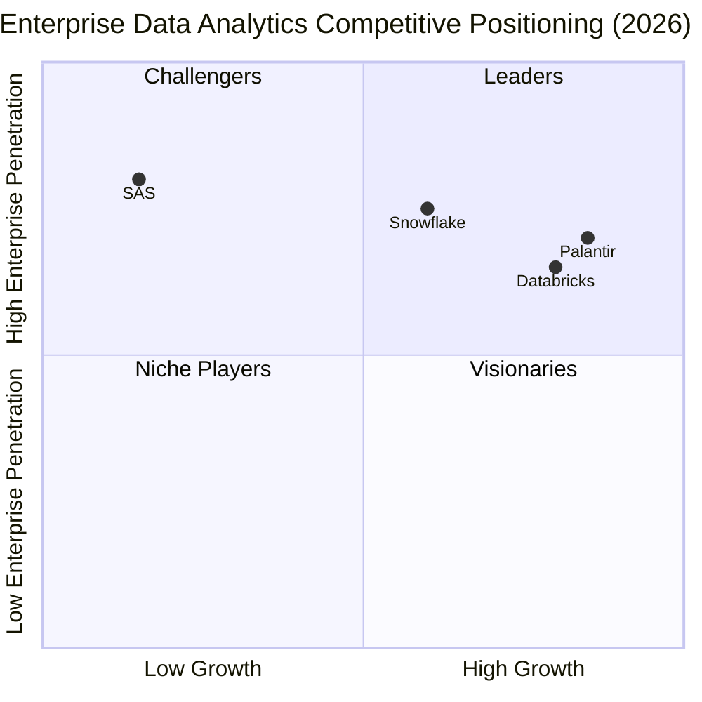

# Global Enterprise Data Analytics Market: Comprehensive Research Report – 2026

---

## 1. Executive Summary

The global enterprise data analytics market is undergoing a structural transformation in 2026, driven by the convergence of cloud-native architectures, generative AI integration, and enterprise-wide data modernization initiatives. Market size estimates range from **USD 104–109 billion** in 2026, growing at a CAGR of approximately 22–32% depending on scope definition. The competitive landscape is dominated by four archetypes: **Palantir** (operational AI/defense-entrenched), **Snowflake** (SQL-first analytics cloud), **Databricks** (open lakehouse for AI/ML), and **SAS** (regulated-industry incumbency). Cloud partnerships, AI-driven analytics, and a shifting regulatory environment are reshaping how vendors acquire clients, price contracts, and defend moats.

---

## 2. Market Size, Structure, and Growth Potential

### 2.1 Overall Market Size

Multiple analyst estimates converge on a 2026 data analytics market between **USD 104–121 billion**, with aggressive growth trajectories through the early 2030s.

| Source | 2026 Market Size (USD) | CAGR (Forecast Period) | 2031/2034 Projection |
|---|---|---|---|
| Mordor Intelligence | 108.79 B | 32.15% (2026–2031) | 438.47 B (2031) |
| Grand View Research | 107.0 B | 31.8% (2026–2033) | 738.6 B (2033) |
| Fortune Business Insights | 104.39 B | 21.50% (2026–2034) | 495.87 B (2034) |
| The Business Research Co. | 120.63 B | 29.0% (2026–2030) | 333.99 B (2030) |
| MarketsandMarkets (Big Data) | 324.59 B | 9.7% (2026–2031) | 516.29 B (2031) |

*Sources: [Mordor Intelligence](https://www.mordorintelligence.com/industry-reports/data-analytics-market), [Grand View Research](https://www.grandviewresearch.com/industry-analysis/data-analytics-market-report), [Fortune Business Insights](https://www.fortunebusinessinsights.com/data-analytics-market-108882), [The Business Research Company](https://www.thebusinessresearchcompany.com/report/data-analytics-global-market-report), [MarketsandMarkets](https://www.marketsandmarkets.com/Market-Reports/big-data-market-1068.html)*

**Key structural characteristics:**
- **Cloud deployment** is the fastest-growing segment (CAGR 33%+), though on-premises still held 64% of revenue in 2025.
- **Large enterprises** capture ~69% of revenue, but SMEs are growing at ~33% CAGR.
- **North America** holds ~32–37% market share, with Asia Pacific the fastest-growing region.
- **Data discovery and visualization** was the largest application segment (57% share in 2026).

### 2.2 Growth Drivers

1. **AI/ML Integration**: 77% of organizations cite analytics as the principal lever for operational efficiency (Mordor Intelligence).
2. **Cloud Migration**: Six consecutive years of double-digit cloud revenue growth across major vendors.
3. **Agentic AI**: By end of 2026, Gartner predicts 40% of enterprise applications will incorporate task-specific AI agents.
4. **Data Sovereignty Demand**: Enterprise buyers increasingly require that proprietary data not become training data for external AI models.

---

## 3. Industry Vertical Adoption and Regulatory Concerns

### 3.1 Vertical Market Share and Adoption Leadership

| Vertical | Share of Analytics Market (2026) | Key Drivers | Regulatory Intensity |
|---|---|---|---|
| **BFSI (Banking, Financial Services, Insurance)** | ~22% (largest) | Fraud detection, risk management, real-time analytics, model governance | **Very High** (GDPR, CCPA, SOX, model risk management) |
| **Healthcare & Life Sciences** | ~15–18% (fastest-growing, ~21.9% CAGR) | Clinical analytics, population health, AI diagnostics, value-based care | **Very High** (HIPAA, GDPR, FDA AI oversight) |
| **Retail & E-commerce** | ~20% | Customer analytics, demand forecasting, personalized marketing, inventory optimization | **Moderate** (CCPA, state privacy laws) |
| **Government & Defense** | ~10–12% | National security, intelligence analytics, operational planning, fraud detection | **Extreme** (ITAR, FedRAMP, classified environments, export controls) |
| **IT & Telecom** | ~12–15% | Network optimization, customer churn, infrastructure monitoring | **Moderate** |

*Sources: [Fortune Business Insights](https://www.fortunebusinessinsights.com/big-data-analytics-market-106179), [Mordor Intelligence](https://www.mordorintelligence.com/industry-reports/data-analytics-market), [Yahoo Finance – High-Performance Data Analytics Market](https://finance.yahoo.com/news/high-performance-data-analytics-market-100100069.html)*

**Adoption Leaders:**
- **BFSI** remains the dominant vertical due to the highest volume of structured transactional data and the strongest regulatory push for model governance and explainability.
- **Healthcare** is the fastest-growing vertical, with the U.S. healthcare big data analytics market alone reaching USD 27.4 billion in 2026 ([IMARC Group](https://www.imarcgroup.com/united-states-healthcare-big-data-analytics-market)).
- **Retail** is a major spender on customer analytics, with the segment holding 20.7% of the customer analytics market in 2025.

### 3.2 Regulatory Landscape Shaping Demand

#### Finance
- **Model Risk Management (SR 11-7)** : Requires documented model inventory, validation artifacts, and monitoring reports.
- **GDPR/CCPA**: Client data handling imposes strict processing boundaries.
- **SOC 2**: Procurement teams increasingly require SOC 2 reports before allowing AI systems to process sensitive data.
- **Cumulative GDPR fines** exceeded €7.1 billion by 2026 ([Secureframe](https://secureframe.com/blog/data-protection-trends)).

#### Healthcare
- **HIPAA**: Administrative, physical, and technical safeguards for protected health information (PHI).
- **FDA AI Oversight**: Clinical safety rationale and dataset governance required for AI/ML-enabled medical devices.
- **Telehealth Data**: Expanded privacy challenges from the telehealth revolution.

#### Defense/Government
- **ITAR (International Traffic in Arms Regulations)** : Export-control handling constraints.
- **FedRAMP**: Cloud service authorization for federal agencies.
- **National Defense Authorization Act (NDAA) FY2026**: Advances outbound investment security measures that affect data flows.
- **Executive Orders on Data Brokerage**: Penalties up to $368,136 in civil fines or 20 years imprisonment for willful violations involving "countries of concern" ([Vantage Point](https://vantagepoint.io/blog/sf/insights/data-privacy-2026-business-leaders-guide)).

#### Cross-Vertical Trends
- **20 U.S. states** now have comprehensive privacy legislation, creating a complex compliance patchwork in the absence of federal privacy law.
- **Colorado AI Act** (effective 2026) regulates high-stakes algorithmic decisions in employment, housing, healthcare, and financial services.
- **California CPPA** issued the largest-ever CCPA penalty in 2025, and new regulations effective January 2026 require cybersecurity audits, risk assessments, and automated decision-making technology compliance.

---

## 4. Competitive Positioning: Palantir, Snowflake, Databricks, and SAS

### 4.1 Company Comparison: Key Financial Metrics (2025–2026)

| Metric | Palantir | Snowflake | Databricks | SAS |
|---|---|---|---|---|
| **Revenue (FY2025)** | $4.48 B | $3.63 B (product: $3.46 B) | ~$4.5 B (run-rate Dec 2025) | >$3 B (private) |
| **Revenue Growth (2025 YoY)** | 56% | 29% (product) | 55%+ | ~3–4% (overall, Viya 20%+) |
| **2026 Revenue (Run-Rate/Latest)** | $8.15–8.16 B (guidance) | $4.68 B (FY2026, product: $4.47 B) | $7.0 B (Q2 2026 run-rate) | >$3 B (est. flat to low growth) |
| **2026 YoY Growth** | ~82% | 29% (product) | >80% | ~20% (Viya only) |
| **Customers** | 1,007 (total) | 12,621; 766 Global 2000 | 15,000+ | 83,000+ sites (legacy) |
| **$1M+ Customers** | 206 deals ≥$1M (Q1 2026) | 688 (trailing 12-month) | 1,000+ | N/A (enterprise model) |
| **Net Dollar Retention** | 157% (Q2 2026) | 125% | >140% | N/A |
| **Valuation / Market Cap** | ~$370 B (market cap) | ~$65 B (market cap) | $190 B (private) | Private (est. ~$10–15 B) |
| **Gross Margin** | ~80% | 72% (GAAP product) | ~80% | ~70%+ |
| **Operating Margin** | 60% (adj., Q1 2026) | 10% (non-GAAP FY2026) | FCF positive (12 months) | Profitable (debt-free) |

*Sources: [Palantir Q1 2026 Business Update](https://investors.palantir.com/files/Palantir%20-%20Q1%202026%20Business%20Update.pdf), [Palantir Q2 2026 earnings](https://investors.palantir.com/news-details/2026/Palantir-Reports-Q2-2026-U-S--Comm-Revenue-Growth-of-149-YY-and-Revenue-Growth-of-93-YY-Raises-FY-2026-Revenue-Guidance-to-82-YY-Growth-and-U-S--Comm-Revenue-Guidance-to-134-YY-Crushing-Consensus-Expectations), [Snowflake FY2026 results](https://www.snowflake.com/en/news/press-releases/snowflake-reports-financial-results-for-the-fourth-quarter-and-full-year-of-fiscal-2026), [Snowflake Q3 FY2026](https://investors.snowflake.com/financials/quarterly-results/default.aspx), [Databricks Q2 2026 press release](https://www.databricks.com/company/newsroom/press-releases/databricks-grows-80-yoy-surpasses-7b-revenue-run-rate-scales), [Databricks Dec 2025 release](https://www.databricks.com/company/newsroom/press-releases/databricks-surpasses-4-8b-revenue-run-rate-growing-55-year-over-year), [SAS Annual Report 2025](https://www.sas.com/en_us/company-information/annual-report.html), [CNBC – Palantir Q2 2026](https://www.cnbc.com/2026/08/03/palantir-pltr-earnings-q2-2026.html)*

### 4.2 Client Acquisition, Revenue per Customer, and Government Contracts

#### Palantir
- **Client Acquisition**: Palantir's AIP Bootcamps (hands-on-keyboard, outcomes-in-hours) are the primary customer acquisition engine. U.S. commercial customer count reached 615 in Q1 2026 (+42% YoY). Total customers reached 1,007.
- **Revenue per Customer**: Extremely high. U.S. commercial remaining deal value (RDV) reached $4.92 B in Q1 2026, implying ~$8M average RDV per commercial customer. Net dollar retention of 157% indicates massive expansion within existing accounts.
- **Government Contracts**: Palantir's U.S. government revenue was $687 M in Q1 2026 (+84% YoY) and $809 M in Q2 2026 (+90% YoY). Landmark contracts include:
  - **$10 B U.S. Army contract** (10-year, awarded August 2025)
  - **$300 M USDA contract** (April 2026)
  - **£670 M+ in UK government contracts** (NHS Federated Data Platform, Ministry of Defence)
  - 73 contracts ≥$10 M in Q2 2026 alone
  - Total long-term RPO exceeded $15 B by Q2 2026

#### Snowflake
- **Client Acquisition**: 12,621 total customers (+20% YoY as of Q3 FY2026), with 766 Forbes Global 2000 customers. 688 customers with >$1 M trailing 12-month product revenue.
- **Revenue per Customer**: Average revenue per customer ~$370 K (product revenue / total customers). Net revenue retention of 125% indicates healthy expansion.
- **Government Contracts**: Snowflake has FedRAMP authorization and serves multiple federal agencies, but government is not a disclosed segment. The company's focus is commercial enterprise.

#### Databricks
- **Client Acquisition**: 15,000+ customers. 1,000+ customers consuming >$1 M annual run-rate, 100+ customers >$10 M run-rate. Net retention >140%.
- **Revenue per Customer**: Very high. With ~$7 B run-rate and 15,000 customers, average revenue per customer ~$467 K, but the long tail skews this; 50 customers alone spend >$10 M annually.
- **Government Contracts**: Databricks has FedRAMP authorization and serves defense/intelligence agencies through its Unity Catalog governance and classified cloud deployments, but government is not a primary disclosed segment.

#### SAS
- **Client Acquisition**: 83,000+ customer sites globally (legacy enterprise base). Viya has ~942 identifiable customers as of 2026. SAS relies on GSIs (Accenture, Deloitte) for new logo acquisition.
- **Revenue per Customer**: Moderate to high. With >$3 B revenue across 83,000 sites, average is ~$36 K/site, but enterprise deals can be $1–10 M+.
- **Government Contracts**: SAS has deep incumbency in federal, state, and local government (fraud detection, tax analytics, census, defense logistics). FedRAMP authorized.

### 4.3 Flagship Products and Platforms

| Company | Flagship Platform | Core Differentiator | AI/ML Layer | Key Integrations |
|---|---|---|---|---|
| **Palantir** | **Foundry + AIP (Artificial Intelligence Platform) + Apollo** | Ontology-driven operational AI; forward-deployed engineering | AIP Logic, AIP Chatbot Studio, AIP Evals, LLM-powered agents | Google Cloud, AWS, Azure; Snowflake partnership; NVIDIA |
| **Snowflake** | **Snowflake AI Data Cloud** | SQL-native, cloud-agnostic, fully managed; separation of storage and compute | Snowflake Cortex AI, Snowflake Intelligence, Cortex Agents | AWS, Azure, GCP; Palantir; Informatica; Gemini 3 |
| **Databricks** | **Databricks Lakehouse Platform (Unity Catalog, MLflow, Delta Lake, Lakebase)** | Open-source foundation (Spark, Delta Lake, MLflow); unified data + AI | Databricks Genie, Unity AI Gateway, Agent Bricks, Mosaic AI | AWS, Azure, GCP; Microsoft partnership; Anthropic |
| **SAS** | **SAS Viya (cloud-native) + SAS Solutions** | Regulated-industry trust; statistical rigor; explainable AI; 50-year heritage | Viya Copilot, Decision Builder, Data Maker (synthetic data), model governance | Azure, AWS; Snowflake, Databricks integrations; Microsoft Fabric |

*Sources: [Palantir Platform Overview](https://palantir.com/docs/foundry/platform-overview/overview), [Palantir AIP Overview](https://palantir.com/docs/foundry/aip/overview), [Snowflake Cloud Partners](https://www.snowflake.com/en/why-snowflake/partners/cloud-partners), [Databricks vs Snowflake](https://www.databricks.com/databricks-vs-snowflake), [SAS Viya](https://www.sas.com/en_us/software/viya.html)*

---

## 5. Competitive Dynamics: Cloud Partnerships and AI-Driven Analytics

### 5.1 Cloud Partnership Strategy

The major analytics vendors have adopted distinct multi-cloud strategies:

| Company | Primary Cloud Partners | Strategy |
|---|---|---|
| **Palantir** | **Google Cloud** (strategic Foundry partnership), AWS, Azure | Palantir Foundry runs on Google Cloud as a fully managed SaaS; also supports AWS and Azure. Recent Snowflake partnership for data interoperability. |
| **Snowflake** | **AWS, Azure, GCP** (true multi-cloud) | Runs on all three major clouds; customers can draw down on cloud commitments. Deep marketplace integrations with all three. |
| **Databricks** | **AWS, Azure, GCP** (multi-cloud, Azure strongest) | Deepest Azure integration (Microsoft partnership expanded July 2026). Unity Catalog federates catalogs across AWS Glue, Google Cloud, and Snowflake. |
| **SAS** | **Azure, AWS** (Viya on both); adding Snowflake/Databricks integrations | Viya as a service via hyperscalers with consumption-based pricing targeted for 2026. |

*Sources: [Palantir Cloud Partners](https://www.palantir.com/partnerships/cloud), [Palantir on Google Cloud](https://cloud.google.com/solutions/palantir), [Snowflake Cloud Partners](https://www.snowflake.com/en/why-snowflake/partners/cloud-partners), [Databricks Microsoft Partnership](https://www.databricks.com/company/newsroom/press-releases/databricks-and-microsoft-expand-partnership-help-enterprises-bring-business-context), [SAS Viya Cloud Growth Plan](https://futurumgroup.com/insights/sas-institute-pioneer-in-analytics-pivots-to-cloud-and-ai-growth)*

### 5.2 AI-Driven Analytics: The Competitive Frontier

The AI arms race in 2026 is defined by **agentic AI**, **AI governance**, and **data sovereignty**:

- **Palantir** has leaned hardest into "AI Sovereignty" — the concept that enterprise data should never become training data for public AI models. CEO Alex Karp has made this the central competitive differentiator. AIP enables customers to deploy LLMs, vision-language models, and edge AI on their own data within Palantir's ontology. The company's **AIP Bootcamps** are a unique acquisition mechanism that compresses sales cycles from months to days.

- **Snowflake** has positioned **Cortex AI** and **Snowflake Intelligence** as the easiest on-ramp for SQL-native AI. Cortex Agents (launched 2025) coordinate multiple AI agents for complex analytical workflows. Snowflake's acquisition of Crunchy Data ($250 M, June 2025) and Datometry (November 2025) expanded its AI database and migration capabilities. AI-powered 25% of customer projects by mid-2026.

- **Databricks** has re-accelerated growth to 80%+ by betting on **open standards** (Delta Lake, MLflow, Unity Catalog, Apache Iceberg). The company's **Lakebase** (serverless Postgres for AI agents) crossed $100 M run-rate. **Genie** (AI coworker) and **Unity AI Gateway** (multi-AI governance and cost optimization) represent the most complete agentic AI stack. Over 52% of Snowflake customers also use Databricks, indicating significant co-existence.

- **SAS** is pursuing a "governed AI" strategy targeting regulated industries. **Viya Copilot** and **Data Maker** (synthetic data generation) address the compliance-first buyer. SAS's $1 B AI investment pledge through 2026 and its Hazy acquisition (synthetic data) underscore the bet on explainable, auditable AI. However, growth remains modest compared to the cloud-native competitors.

### 5.3 Competitive Landscape Summary

---

## 6. Quantitative Comparison Tables

### 6.1 Revenue Growth Trajectory (2022–2026)

| Year | Palantir | Snowflake (Product) | Databricks (Run-Rate) | SAS |
|---|---|---|---|---|
| 2022 | $1.91 B | $2.07 B | ~$1.5 B | >$3 B |
| 2023 | $2.23 B | $2.67 B | ~$2.5 B | >$3 B |
| 2024 | $2.87 B | $3.15 B | ~$3.5 B | >$3 B |
| 2025 | $4.48 B | $3.46 B | ~$4.8 B (Q3 run-rate) | >$3 B |
| 2026 (E) | $8.15–8.16 B | $4.47 B | $7.0 B (Q2 run-rate) | >$3 B |

### 6.2 Key Operational Metrics (Most Recent Quarter)

| Metric | Palantir (Q2 2026) | Snowflake (Q3 FY2026) | Databricks (Q2 2026) |
|---|---|---|---|
| Revenue | $1.935 B | $1.16 B (product) | $7.0 B (annualized run-rate) |
| YoY Growth | 93% | 29% | >80% |
| Gross Margin | 86% (adj.) | 72% (GAAP product) | ~80% |
| Operating Margin | 62% (adj.) | ~10% (non-GAAP) | FCF positive |
| Net Dollar Retention | 157% | 125% | >140% |
| Customers | 1,007 | 12,621 | 15,000+ |
| $1M+ Customers | 73 deals ≥$10M | 688 | 1,000+ |

---

## 7. Strategic Outlook

1. **Palantir** is the fastest-growing major analytics vendor in 2026, with revenue growth accelerating from 56% to an expected 82%+ for the full year. Its "AI Sovereignty" narrative and unmatched government incumbency (including the $10 B Army contract) create a powerful moat. The risk is valuation (market cap ~$370 B, >45x revenue) and the dependence on continued government spending.

2. **Databricks** has achieved the rare feat of re-accelerating at scale (65% → 80%+ growth between $4 B and $7 B run-rate). Open-source stickiness, Unity Catalog governance, and the AI agent stack (Genie, Lakebase) position it as the default platform for AI-native enterprises. The $190 B valuation implies a ~27x run-rate multiple, tightening but defensible given growth.

3. **Snowflake** remains the safe choice for SQL-first analytics at scale, with predictable 27–30% growth and the widest cloud ecosystem. The challenge is that AI workloads are growing faster on Databricks, and Snowflake's AI capabilities (Cortex, Intelligence) are catching up rather than leading. The 125% net retention and 766 Global 2000 customers provide a solid base.

4. **SAS** is a stable but slow-growth incumbent. Its 50-year brand and deep relationships in banking, insurance, healthcare, and government are valuable, but the shift to Viya is not generating the hypergrowth seen at cloud-native competitors. The potential IPO (guided for 2025–2026, now likely 2026–2027) could unlock value, but SAS is unlikely to disrupt the market leaders.

---

## 8. References

1. Mordor Intelligence – Data Analytics Market Size, Share & Forecast (2026–2031): https://www.mordorintelligence.com/industry-reports/data-analytics-market
2. Grand View Research – Data Analytics Market Size and Share Report (2026–2033): https://www.grandviewresearch.com/industry-analysis/data-analytics-market-report
3. Fortune Business Insights – Data Analytics Market Size, Share & Growth Report (2026–2034): https://www.fortunebusinessinsights.com/data-analytics-market-108882
4. MarketsandMarkets – Big Data Market Report (2026–2031): https://www.marketsandmarkets.com/Market-Reports/big-data-market-1068.html
5. Palantir Q1 2026 Business Update (PDF): https://investors.palantir.com/files/Palantir%20-%20Q1%202026%20Business%20Update.pdf
6. Palantir Q2 2026 Earnings Release: https://investors.palantir.com/news-details/2026/Palantir-Reports-Q2-2026-U-S--Comm-Revenue-Growth-of-149-YY-and-Revenue-Growth-of-93-YY-Raises-FY-2026-Revenue-Guidance-to-82-YY-Growth-and-U-S--Comm-Revenue-Guidance-to-134-YY-Crushing-Consensus-Expectations
7. Palantir Q4 2025 Earnings (SEC Filing): https://www.sec.gov/Archives/edgar/data/1321655/000132165526000004/a2025q4ex991earningsrelease.htm
8. Snowflake FY2026 (Q4) Results: https://www.snowflake.com/en/news/press-releases/snowflake-reports-financial-results-for-the-fourth-quarter-and-full-year-of-fiscal-2026
9. Snowflake Q2 FY2026 Earnings Transcript: https://finance.yahoo.com/quote/SNOW/earnings/SNOW-Q2-2026-earnings_call-349058.html
10. Databricks – Surpasses $7B Revenue Run-Rate (Aug 2026): https://www.databricks.com/company/newsroom/press-releases/databricks-grows-80-yoy-surpasses-7b-revenue-run-rate-scales
11. Databricks – Surpasses $5.4B Revenue Run-Rate (Feb 2026): https://www.databricks.com/company/newsroom/press-releases/databricks-grows-65-yoy-surpasses-5-4-billion-revenue-run-rate
12. Databricks – Surpasses $4.8B Revenue Run-Rate (Dec 2025): https://www.databricks.com/company/newsroom/press-releases/databricks-surpasses-4-8b-revenue-run-rate-growing-55-year-over-year
13. SAS Annual Report and Corporate Overview (2025): https://www.sas.com/en_us/company-information/annual-report.html
14. SAS Viya Platform: https://www.sas.com/en_us/software/viya.html
15. Palantir Platform Overview: https://palantir.com/docs/foundry/platform-overview/overview
16. Palantir AIP Overview: https://palantir.com/docs/foundry/aip/overview
17. Snowflake vs Databricks Comparison (Databricks): https://www.databricks.com/databricks-vs-snowflake
18. Snowflake and Palantir Partnership Announcement: https://www.snowflake.com/en/news/press-releases/snowflake-palantir-announce-strategic-partnership-for-enterprise-ready-ai-analytics
19. Palantir on Google Cloud: https://cloud.google.com/solutions/palantir
20. CNBC – Palantir Q2 2026 Earnings: https://www.cnbc.com/2026/08/03/palantir-pltr-earnings-q2-2026.html
21. CNBC – Palantir Q4 2025 Earnings: https://www.cnbc.com/2026/02/02/palantir-pltr-q4-2025-earnings.html
22. Reuters – Palantir CEO Defends Surveillance Tech as Government Contracts Boost Sales: https://www.reuters.com/world/europe/palantir-ceo-defends-surveillance-tech-us-government-contracts-boost-sales-2026-02-02
23. Al Jazeera – Why $370bn tech group Palantir pays 1.4 percent tax rate: https://www.aljazeera.com/news/2026/8/6/why-370bn-tech-group-palantir-pays-just-1-4-percent-tax-report
24. Secureframe – Data Protection Trends 2026: https://secureframe.com/blog/data-protection-trends
25. Vantage Point – Data Privacy in 2026: https://vantagepoint.io/blog/sf/insights/data-privacy-2026-business-leaders-guide
26. Glean – Top 7 Industries with Stringent AI Compliance Needs in 2026: https://www.glean.com/perspectives/top-7-industries-with-stringent-ai-compliance-needs-in-2026
27. Baker Donelson – Privacy Laws Ring in the New Year 2026: https://www.bakerdonelson.com/privacy-laws-ring-in-the-new-year-state-requirements-expand-across-the-us-in-2026
28. Futurum Group – SAS Institute Pivots to Cloud and AI Growth: https://futurumgroup.com/insights/sas-institute-pioneer-in-analytics-pivots-to-cloud-and-ai-growth
29. IMARC Group – U.S. Healthcare Big Data Analytics Market 2026–2034: https://www.imarcgroup.com/united-states-healthcare-big-data-analytics-market
30. SaaStr – Databricks Crosses $7B ARR Growing 80%: https://www.saastr.com/databricks-just-crossed-7b-arr-growing-80-a-30-point-acceleration-a-190b-valuation-and-the-margin-bill-for-agents
31. Thinklytics – Snowflake vs Databricks for AI Workloads 2026: https://thinklytics.com/insights/snowflake-vs-databricks-ai-workloads-2026
32. DataForest – Databricks vs Snowflake Complete Platform Comparison 2026: https://dataforest.ai/blog/databricks-vs-snowflake
33. Definitive – Databricks vs Snowflake Comparison 2026: https://www.definite.app/blog/databricks-vs-snowflake-2026
34. Flexera – Snowflake vs Databricks: 5 Key Features Compared (2026): https://www.flexera.com/blog/finops/snowflake-vs-databricks
35. Built In – SAS Company Growth, Stability & Outlook 2026: https://builtin.com/company/sas/faq/stability-growth
36. Fortune Business Insights – Big Data Analytics Market by Vertical: https://www.fortunebusinessinsights.com/big-data-analytics-market-106179
37. Yahoo Finance – High-Performance Data Analytics Market Report: https://finance.yahoo.com/news/high-performance-data-analytics-market-100100069.html
38. PwC – 2026 Digital Trends in Operations Survey: https://www.pwc.com/us/en/services/consulting/supply-chain-operations/library/digital-trends-operations-survey.html
39. Snowflake Cloud Partners: https://www.snowflake.com/en/why-snowflake/partners/cloud-partners
40. Palantir Cloud Partners: https://www.palantir.com/partnerships/cloud

---

*Report compiled August 2026. Market data reflects the most recent publicly available sources as of the date of publication. All financial figures are in U.S. dollars unless otherwise noted.*

